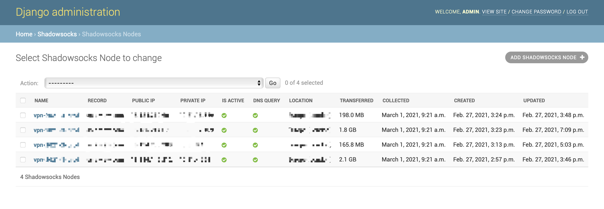
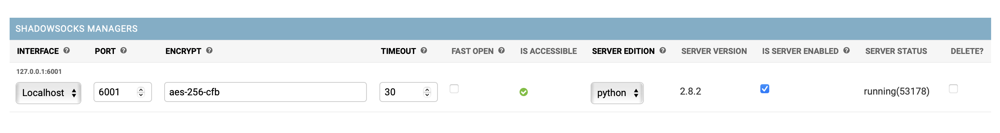

[](https://github.com/alexzhangs/shadowsocks-manager/)
[](https://github.com/alexzhangs/shadowsocks-manager/)
[](https://github.com/alexzhangs/shadowsocks-manager/)

[](https://travis-ci.com/alexzhangs/shadowsocks-manager)
[](https://codecov.io/gh/alexzhangs/shadowsocks-manager)
[](https://github.com/alexzhangs/shadowsocks-manager/)
[](https://github.com/alexzhangs/shadowsocks-manager/)

| Python:2.7        | Python:3.6        | Python:3.7        | Python:3.8        | Python:3.9        |
|-------------------|-------------------|-------------------|-------------------|-------------------|
| [![Build1][1]][0] | [![Build2][2]][0] | [![Build3][3]][0] | [![Build4][4]][0] | [![Build5][5]][0] |

[0]: https://travis-ci.org/alexzhangs/shadowsocks-manager
[1]: https://travis-matrix-badges.herokuapp.com/repos/alexzhangs/shadowsocks-manager/branches/master/1?use_travis_com=true
[2]: https://travis-matrix-badges.herokuapp.com/repos/alexzhangs/shadowsocks-manager/branches/master/2?use_travis_com=true
[3]: https://travis-matrix-badges.herokuapp.com/repos/alexzhangs/shadowsocks-manager/branches/master/3?use_travis_com=true
[4]: https://travis-matrix-badges.herokuapp.com/repos/alexzhangs/shadowsocks-manager/branches/master/4?use_travis_com=true
[5]: https://travis-matrix-badges.herokuapp.com/repos/alexzhangs/shadowsocks-manager/branches/master/5?use_travis_com=true

# shadowsocks-manager

A web-based Shadowsocks management tool.

Features:

* Central user management
* Heartbeat on Shadowsocks ports(users)
* Shadowsocks multi-user API
* Shadowsocks node cluster
* Statistic for network traffic usage
* Scheduled jobs
* name.com API
* Auto-creating DNS records
* Production deployment ready
* How's the Shadowsocks supported:
    * libev version:
        * Full functional.
        * No builtin service manager, you need to install it and start the service by yourself.
    * python version:
        * Lacks the collection of traffic statistics.
        * Lacks the ability to test user port creation status.
        * Pre-installed, and have a builtin service manager.

Code in Python, base on Django, Django REST framework, Celery, and SQLite.

The development status can be found at: [project home](https://github.com/alexzhangs/shadowsocks-manager/projects/1).

Node List:


Node's Shadowsocks Manager:



## 1. Requirements

* Python 2.7, Python 3.x
* Django 1.11.x, Django 3.x
* macOS Big Sur (only the core python code tested, the installation scripts
  work on Linux only)
* [AWS Amazon Linux AMI](https://aws.amazon.com/amazon-linux-ami/)
* [AWS Amazon Linux 2 AMI](https://aws.amazon.com/amazon-linux-2/)
* [Shadowsocks-libev 3.2.0 for Linux (multi-user API is required)](https://github.com/shadowsocks/shadowsocks-libev)


## 2. Install

NOTE: It's better to install the project within a virtualenv.

Open a terminal on the server in which the shadowsocks-manager is going to run.

1. Get the code:

    ```sh
    git clone https://github.com/alexzhangs/shadowsocks-manager
    ```

1. Install

    The installation scripts can WORK ONLY ON LINUX and be tested only with Amazon Linux AMI and Amazon Linux 2 AMI.

    Run below commands under root.

    ```sh
    bash shadowsocks-manager/one-click-deploy.sh
    ```

    If you want to customize the shadowsocks-manager installation, see: `bash shadowsocks-manager/one-click-deploy.sh -h`:

    ```
    Description:
      Deploy shadowsocks-manager with one single command.
      Run this script under root on Linux.
    
    Usage:
      one-click-deploy.sh [-n DOMAIN] [-u USERNAME] [-p PASSWORD] [-e EMAIL] [-t TIMEZONE] [-o PORT_BEGIN] [-O PORT_END] [-h]
    
    Options:
      [-n DOMAIN]
    
      Domain name resolved to the shadowsocks-manager web application.
    
      [-u USERNAME]
    
      Username for shadowsocks-manager administrator, default is 'admin'.
    
      [-p PASSWORD]
    
      Password for shadowsocks-manager administrator, default is 'passw0rd'.
    
      [-e EMAIL]
    
      Email for the shadowsocks-manager administrator.
      Also, be used as the sender of the account notification Email.
    
      [-t TIMEZONE]
    
      Set Django's timezone, default is 'UTC'.
      Statistic period also senses this setting. Note that AWS billing is based on UTC.
    
      [-r PORT_BEGIN]
    
      Port range allowed for all Shadowsocks nodes.
    
      [-R PORT_END]
    
      Port range allowed for all Shadowsocks nodes.
    
      [-h]
    
      This help.
    ```

1. Verify the installation

    If all go smoothly, the shadowsocks-manager services should have been all started. Open the web admin console in a web browser, and log on with the admin user.

    Use:
    ```
    http://<your_server_ip>/admin
    ```

    If goes well, then congratulations! The installation has succeeded.


## 3. Using shadowsocks-manager

1. Shadowsocks server

    First, you need to have a Shadowsocks server with the multi-user API
enabled.

    About how to install and configure Shadowsocks server in AWS, refer
to the repo
[aws-ec2-shadowsocks-libev](https://github.com/alexzhangs/aws-ec2-shadowsocks-libev)

    After the server is installed and started, there should be a
running process named `ss-manager`. Write down the IP address and
the port that the `ss-manager` is listening on, and also the public IP
address of the server, the encryption method that Shadowsocks is using,
they are going to be used in the next step.

1. Add Shadowsocks server to shadowsocks-manager

    Add the Shadowsocks server as a Node of shadowsocks-manager from
web admin console: `Home › Shadowsocks › Shadowsocks Nodes`.

1. Create users(ports) and assign Shadowsocks Node

    Create users from web admin console: `Home › Shadowsocks ›
Shadowsocks Accounts` and assign the existing nodes to them.

    After a few seconds, the created user ports should be available to your
Shadowsocks client.

1. The builtin local service manager for Shadowsocks python version

    There's a builtin local service manager available for the Shadowsocks `python version`. 

    The `python version` is pre-installed with `shadowsocks-manager`. With the service manager, you can start&stop
the local service daemon on-the-fly. Check it out from the web admin console `Home › Shadowsocks › Shadowsocks Nodes`, 
under the `SHADOWSOCKS MANAGERS` tab.

    However the `traffice statistics` and `user port creation status` features are not available for the 
`python version`.


## 4. Sendmail (Optional)

`sendmail` is used to send account notification Email, it should
be configured on the same server with shadowsocks-manager.

About how to configure `sendmail` client to use AWS SES as SMTP server on AWS EC2 instance, refer to repo
[aws-ec2-ses](https://github.com/alexzhangs/aws-ec2-ses).

On macOS, refer to repo
[macos-aws-ses](https://github.com/alexzhangs/macos-aws-ses).

NOTE: This dependency needs the manual setup anyway, it is not handled by any installation script.


## 5. Can the installation be easier?

Yes, if you are deploying the services in the AWS.

[aws-cfn-vpn](https://github.com/alexzhangs/aws-cfn-vpn)
is a set of AWS CloudFormation templates which let you
deploy VPN services, including Shadowsocks (support cluster) and
XL2TPD, with a single click. Also, this repo, shadowsocks-manager and
all its dependencies are handled by `aws-cfn-vpn`.


## 6. Differences from the alternation: [shadowsocks/shadowsocks-manager](https://github.com/shadowsocks/shadowsocks-manager)

**This repo Do's:**

* Serve as a nonprofit business model.
* Have central user management for multi nodes.
* Collect traffic statistic that can be viewed by account, node, and period.
* Show the existence and accessibility of ports in the admin.
* Handle the DNS records if using Name.com as nameserver.

**This repo Don'ts:**

* Handle self-serviced user registration.
* Handle bill or payment.
* Need to run an additional agent on each Shadowsocks server.


## 7. Some differences between the Shadowsocks Python version and libev version

Although the [Shadowsocks Python version](https://github.com/shadowsocks/shadowsocks/tree/master)
supports the multi-user API, but it doesn't fit this project, here's why:

* The python version code and doc seem to be out of maintenance due to some reason. If you really need this you probably need to fork it and make your own.
* They are having different service process names and CLI interfaces which introduces the complexity of installation.
* The Python version lacks the `list` commands. A pull request was opened years ago but never merged.
* The Python version's `stat` command has a very different way to use, I didn't figure the usage syntax out by looking into the code.
* The Python version's `ping` command returns a simple string `pong` rather than a list of ports.
* The Python version's `ping` command has to be sent as the syntax: `ping:{}` in order to work if tested with `nc`. It caused by the tailing newline: `ping\n`.

So either you get some change on your own or stick with the libev version.

## 8. Known Issues

1. DNS records matching for Node may not be accurate on macOS.
    For unknown reason sometimes DNS query returns only one IP address
while multiple IP addresses were configured for the domain.


## 9. Troubleshooting

1. Check the logs

    ```
    # supervisor
    cat /tmp/supervisord.log

    # uWSGI
    cat /var/log/ssm-uwsgi.log

    # Celery
    cat /var/log/ssm-cerlery*
    ```

1. Check the services

    ```
    # nginx
    service nginx {status|start|stop|reload}

    # supervisor
    service supervisord {status|start|stop|restart}
    supervisorctl reload
    supervisorctl start all

    # uWSGI
    supervisorctl start ssm-uwsgi

    # Celery
    supervisorctl start ssm-celery-worker
    supervisorctl start ssm-celery-beat
    ```

1. Check the listening ports (Linux)

    ```
    # TCP
    netstat -tan

    # UDP
    netstat -uan
    ```
